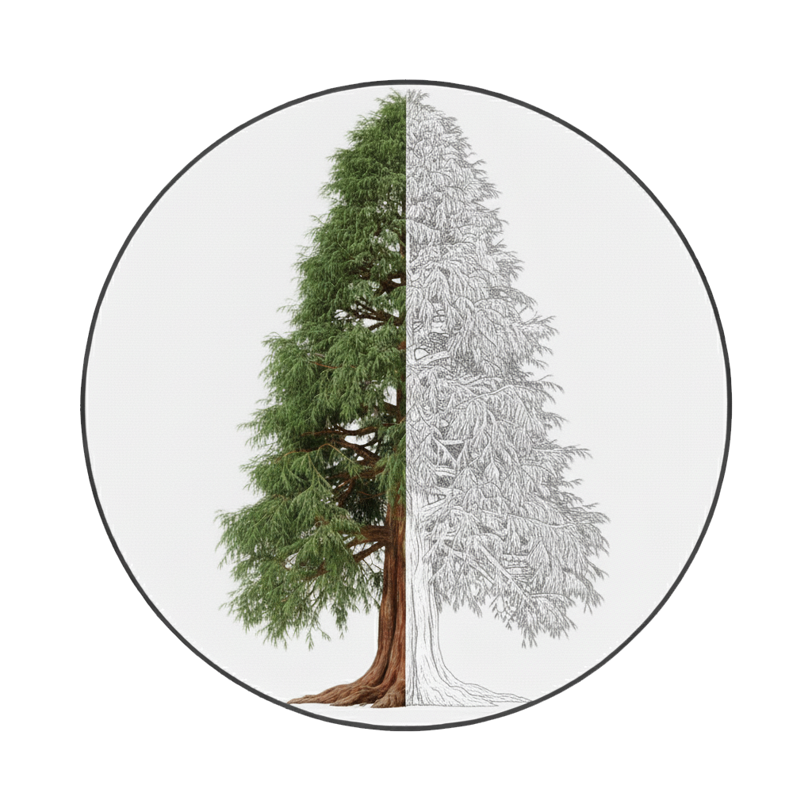
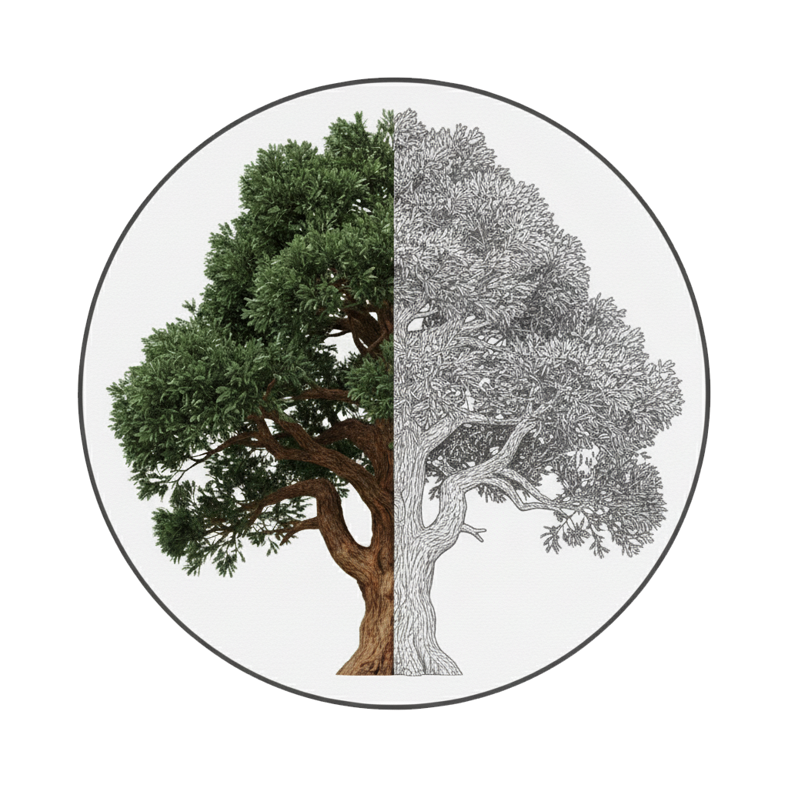
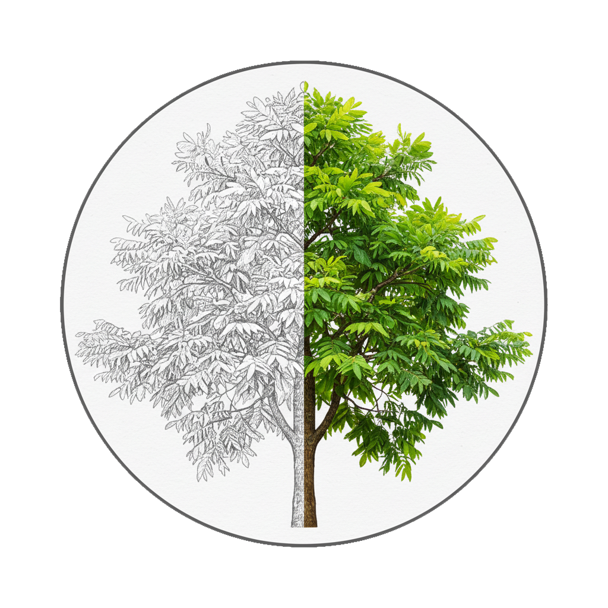
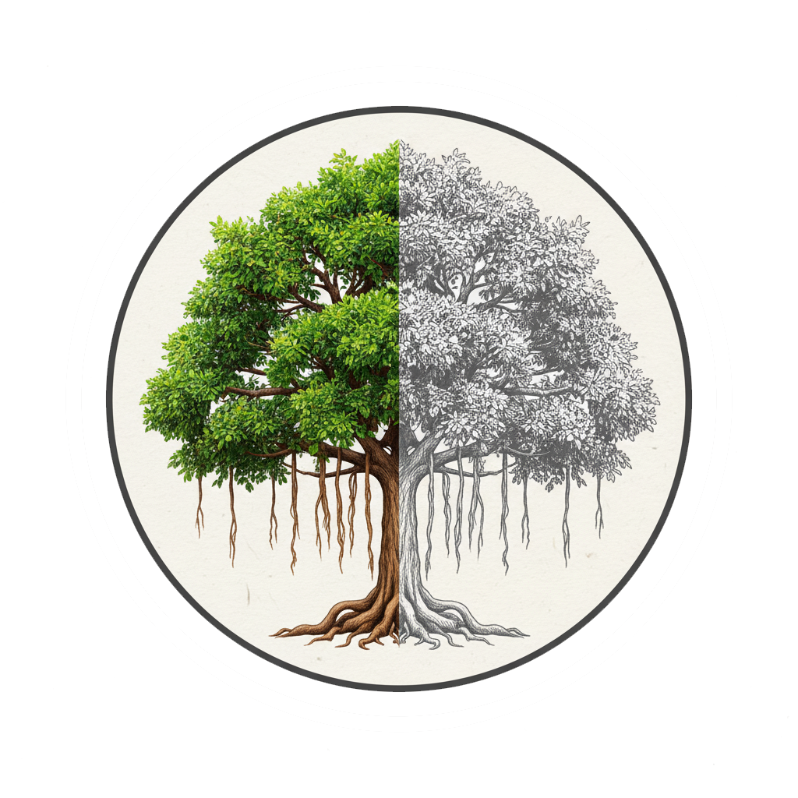

## 高鹿七基-認識環境行動方案的規劃與能力的培養

|任務名稱|任務資訊|執行區間|各小隊執行進度|
|---|---|---|---|
|初始任務|[資訊連結](高鹿七基/認識環境行動方案的規劃與能力的培養/初始任務.md)|2025-09-28 ~ 2025-10-04||
|行動任務-發想你們的行動方案|[資訊連結](高鹿七基/認識環境行動方案的規劃與能力的培養/發想你們的行動方案.md)|2025-10-05 ~ 2025-10-11|

|Tips|||
|---|---|---|
|Tip1|導引員只管做好準備，是否願意學習的選擇留給學習者|[詳細說明](高鹿七基/Tips/Tip1.導引員只管做好準備，是否願意學習的選擇留給學習者.md)|
|Tip2|透過固定的討論與會議，讓行動方案持續推進|[詳細說明](高鹿七基/Tips/Tip2.透過固定的討論與會議，讓行動方案持續推進.md)|
